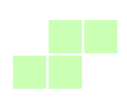

# tetris



- [x] Basic gameplay（random piece、piece rotation and move、clear full lines、scores）
- [x] Game UI
- [x] Game Audio
- [x] Support pausing, resuming and restarting game
- [x] Support web
- [x] Display next piece
- [x] Bag7 random algorithm

## Setup

## Local Setup

- Assumes Rust is installed. If not, see [Rustup](https://rustup.rs/).

Running the game in debug mode:

```sh
cargo run
```

Building the game for release:

```sh
cargo build --release
```

## WASM Setup

- Assumes Rust is installed. If not, see [Rustup](https://rustup.rs/).
- Ensure that the `wasm32-unknown-unknown` target is installed: `rustup target install wasm32-unknown-unknown`

Running locally requires `wasm-server-runner`.

```sh
cargo install wasm-server-runner
cargo run --target=wasm32-unknown-unknown
```

Building the game for release on the web requires the `wasm-bindgen-cli` tool.

```sh
# Ensure its installed!
cargo install wasm-bindgen-cli

# Build the game for WASM.
cargo build --release --target wasm32-unknown-unknown

# Generate the JS bindings.
wasm-bindgen --out-dir=./out/ --target=web ../../target/wasm32-unknown-unknown/release/tetris.wasm
# NOTE that specifically, this repo is a workspace  so target is relative to the workspace root.
```

## Reference

- [Tetris - Wikipedia](https://en.wikipedia.org/wiki/Tetris)
- [Online tetris example1](https://tetris.com/play-tetris)
- [Online tetris example2](https://www.freetetris.org/game.php)
- [bevy-cheatbook](https://github.com/bevy-cheatbook/bevy-cheatbook)
- <https://mbuffett.com/posts/bevy-snake-tutorial/>
